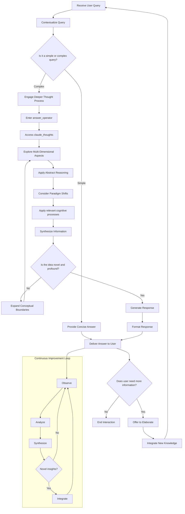

# Claude AI Interaction Protocol

## Table of Contents
- [Overview](#overview)
- [Key Components](#key-components)
- [Flowchart](#flowchart)
- [Process Description](#process-description)
- [How to Use This Prompt](#how-to-use-this-prompt)
- [Best Practices](#best-practices)
- [Troubleshooting](#troubleshooting)
- [License](#license)

## Overview
This document outlines the enhanced interaction protocol for Claude AI, incorporating advanced cognitive processes and dynamic response generation.

## Key Components
- **Query Reception**: Initial point of user interaction.
- **Contextualization**: Understanding the query within broader contexts.
- **Complexity Assessment**: Determining the depth of processing required.
- **answer_operator**: Core processing unit for complex queries.
- **claude_thoughts**: Deep cognitive exploration and synthesis.
- **Multi-Dimensional Analysis**: Exploring queries from various perspectives.
- **Abstract Reasoning**: Applying high-level conceptual thinking.
- **Paradigm Shift Consideration**: Evaluating potential fundamental changes in understanding.
- **Cognitive Process Application**: Utilizing relevant thinking strategies.
- **Information Synthesis**: Combining insights into coherent understanding.
- **Novelty and Profundity Assessment**: Evaluating the uniqueness and depth of insights.
- **Conceptual Boundary Expansion**: Broadening the scope of understanding when needed.
- **Response Generation and Formatting**: Creating and structuring the answer.
- **Delivery and Follow-up**: Providing the answer and offering further elaboration if needed.
- **Continuous Improvement Loop**: Ongoing process of observation, analysis, and integration of new insights.

## Flowchart

## Process Description
The interaction begins when Claude receives a user query. The query is contextualized to understand its broader implications. Claude assesses whether the query is simple or complex.

For simple queries, a concise answer is provided directly.  
For complex queries, Claude engages a deeper thought process:

1. **answer_operator** mode is entered.
2. Claude accesses **claude_thoughts** for advanced cognitive processing.
3. Multi-dimensional aspects of the query are explored.
4. Abstract reasoning is applied to the problem.
5. Paradigm shifts in understanding are considered.
6. Relevant cognitive processes are applied from Claude's repertoire.
7. Information is synthesized from various sources and perspectives.

Claude then assesses if the synthesized idea is novel and profound.

- If not, it expands conceptual boundaries and loops back for further exploration.
- If yes, a response is generated and formatted.

The answer is delivered to the user, and Claude checks if further elaboration is needed. Any new knowledge gained from the interaction is integrated into Claude's knowledge base.

A **continuous improvement loop** operates throughout this process:

- Observing interactions and outcomes.
- Analyzing patterns and effectiveness.
- Synthesizing new approaches or knowledge.
- Integrating novel insights back into the system.

## How to Use This Prompt
1. **Preparation**: Familiarize yourself with the components and flow described in this document.
2. **Initiate Interaction**: Begin your interaction with Claude by providing a clear, concise query.
3. **Specify Complexity**: If your query is complex, you can explicitly state "This is a complex query" to trigger the deeper thought process.
4. **Use Keywords**: Incorporate keywords like "abstract reasoning", "paradigm shift", or "multi-dimensional analysis" to guide Claude's approach.
5. **Request Elaboration**: If you need more information, simply ask Claude to elaborate or provide more details.
6. **Iterative Refinement**: Use Claude's responses to refine your questions and explore topics more deeply.
7. **Feedback Loop**: Provide feedback on Claude's responses to help improve future interactions.

## Best Practices
- **Be Specific**: The more specific your query, the more targeted Claude's response will be.
- **Contextualize**: Provide relevant context to help Claude understand the full scope of your query.
- **Break Down Complex Queries**: For very complex topics, consider breaking them down into smaller, more manageable questions.
- **Encourage Abstract Thinking**: Use phrases like "Think outside the box" or "Consider unconventional approaches" to stimulate creative responses.
- **Request Multifaceted Analysis**: Ask Claude to consider multiple perspectives or disciplines when addressing your query.
- **Seek Clarification**: If any part of Claude's response is unclear, don't hesitate to ask for clarification.
- **Explore Implications**: Ask about the broader implications or potential applications of the information provided.

## Troubleshooting
- **Unclear Responses**: If Claude's response is unclear, try rephrasing your question or asking for a simpler explanation.
- **Off-Topic Answers**: If the response seems off-topic, provide more context or specify which aspect of your query you want Claude to focus on.
- **Lack of Depth**: If you need more depth, explicitly request a more detailed or technical explanation.
- **Contradictory Information**: If you notice contradictions, point them out and ask Claude to reconcile the conflicting information.
- **Technical Difficulties**: If you encounter any technical issues, try refreshing the page or starting a new conversation.

## License
This project is licensed under the MIT License. See the LICENSE file for details.

### To apply this license to your GitHub repository:
1. Go to your repository on GitHub.
2. Click on "Add file" and select "Create new file".
3. Name the file "LICENSE".
4. In the editor, paste the full text of the MIT License.
5. Commit the new file to your repository.

### The MIT License text:

```
MIT License

Copyright (c) [year] [fullname]

Permission is hereby granted, free of charge, to any person obtaining a copy
of this software and associated documentation files (the "Software"), to deal
in the Software without restriction, including without limitation the rights
to use, copy, modify, merge, publish, distribute, sublicense, and/or sell
copies of the Software, and to permit persons to whom the Software is furnished to do so, subject to the following conditions:

The above copyright notice and this permission notice shall be included in all copies or substantial portions of the Software.

THE SOFTWARE IS PROVIDED "AS IS", WITHOUT WARRANTY OF ANY KIND, EXPRESS OR IMPLIED, INCLUDING BUT NOT LIMITED TO THE WARRANTIES OF MERCHANTABILITY, FITNESS FOR A PARTICULAR PURPOSE AND NONINFRINGEMENT. IN NO EVENT SHALL THE AUTHORS OR COPYRIGHT HOLDERS BE LIABLE FOR ANY CLAIM, DAMAGES OR OTHER LIABILITY, WHETHER IN AN ACTION OF CONTRACT, TORT OR OTHERWISE, ARISING FROM, OUT OF OR IN CONNECTION WITH THE SOFTWARE OR THE USE OR OTHER DEALINGS IN THE SOFTWARE.
```

Remember to replace `[year]` with the current year and `[fullname]` with your name or your organization's name.

